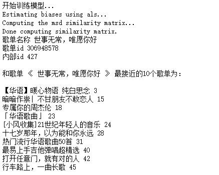
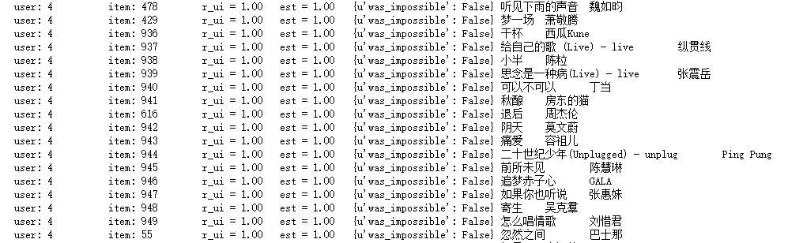

# 音乐推荐系统
#### 语言：python3.5
#### 库：Surprise
#### 平台：jupyter notebook
#### 描述：此推荐系统类似网易云音乐推荐歌单以及推荐相似歌曲。
### 1. 数据获取
使用爬虫爬取了网易云音乐中80w首歌400w+次收藏的歌单，存储格式为json格式，数据大小为3.59G，格式说明如下：
<pre>
1）每个歌单的格式
{
    "result": {
        "id": 111450065,
        "status": 0,
        "commentThreadId": "A_PL_0_111450065",
        "trackCount": 120,
        "updateTime": 1460164523907,
        "commentCount": 227,
        "ordered": true,
        "anonimous": false,
        "highQuality": false,
        "subscribers": [],
        "playCount": 687070,
        "trackNumberUpdateTime": 1460164523907,
        "createTime": 1443528317662,
        "name": "带本书去旅行吧,人生最美好的时光在路上。",
        "cloudTrackCount": 0,
        "shareCount": 149,
        "adType": 0,
        "trackUpdateTime": 1494134249465,
        "userId": 39256799,
        "coverImgId": 3359008023885470,
        "coverImgUrl": "http://p1.music.126.net/2ZFcuSJ6STR8WgzkIi2U-Q==/3359008023885470.jpg",
        "artists": null,
        "newImported": false,
        "subscribed": false,
        "privacy": 0,
        "specialType": 0,
        "description": "现在是一年中最美好的时节，世界上很多地方都不冷不热，有湛蓝的天空和清冽的空气，正是出游的好时光。长假将至，你是不是已经收拾行装准备出发了？行前焦虑症中把衣服、洗漱用品、充电器之类东西忙忙碌碌地丢进箱子，打进背包的时候，我打赌你肯定会留个位置给一位好朋友：书。不是吗？不管是打发时间，小读怡情，还是为了做好攻略备不时之需，亦或是为了小小地装上一把，你都得有一本书傍身呀。读大仲马，我是复仇的伯爵；读柯南道尔，我穿梭在雾都的暗夜；读村上春树，我是寻羊的冒险者；读马尔克斯，目睹百年家族兴衰；读三毛，让灵魂在撒哈拉流浪；读老舍，嗅着老北京的气息；读海茵莱茵，于科幻狂流遨游；读卡夫卡，在城堡中审判……读书的孩子不会孤单，读书的孩子永远幸福。",
        "subscribedCount": 10882,
        "totalDuration": 0,
        "tags": [
            "旅行",
            "钢琴",
            "安静"]
        "creator": {
            "followed": false,
            "remarkName": null,
            "expertTags": [
                "古典",
                "民谣",
                "华语"
            ],
            "userId": 39256799,
            "authority": 0,
            "userType": 0,
            "gender": 1,
            "backgroundImgId": 3427177752524551,
            "city": 360600,
            "mutual": false,
            "avatarUrl": "http://p1.music.126.net/TLRTrJpOM5lr68qJv1IyGQ==/1400777825738419.jpg",
            "avatarImgIdStr": "1400777825738419",
            "detailDescription": "",
            "province": 360000,
            "description": "",
            "birthday": 637516800000,
            "nickname": "有梦人生不觉寒",
            "vipType": 0,
            "avatarImgId": 1400777825738419,
            "defaultAvatar": false,
            "djStatus": 0,
            "accountStatus": 0,
            "backgroundImgIdStr": "3427177752524551",
            "backgroundUrl": "http://p1.music.126.net/LS96S_6VP9Hm7-T447-X0g==/3427177752524551.jpg",
            "signature": "漫无目的的乱听，听着，听着，竟然灵魂出窍了。更多精品音乐美图分享请加我微信hu272367751。微信是我的精神家园，有我最真诚的分享。",
            "authStatus": 0}
        "tracks": [{歌曲1},{歌曲2}, ...]
     }
}
2）每首歌曲的格式为：
{
    "id": 29738501,
    "name": "跟着你到天边 钢琴版",
    "duration": 174001,
    "hearTime": 0,
    "commentThreadId": "R_SO_4_29738501",
    "score": 40,
    "mvid": 0,
    "hMusic": null,
    "disc": "",
    "fee": 0,
    "no": 1,
    "rtUrl": null,
    "ringtone": null,
    "rtUrls": [],
    "rurl": null,
    "status": 0,
    "ftype": 0,
    "mp3Url": "http://m2.music.126.net/vrVa20wHs8iIe0G8Oe7I9Q==/3222668581877701.mp3",
    "audition": null,
    "playedNum": 0,
    "copyrightId": 0,
    "rtype": 0,
    "crbt": null,
    "popularity": 40,
    "dayPlays": 0,
    "alias": [],
    "copyFrom": "",
    "position": 1,
    "starred": false,,
    "starredNum": 0
    "bMusic": {
        "name": "跟着你到天边 钢琴版",
        "extension": "mp3",
        "volumeDelta": 0.0553125,
        "sr": 44100,
        "dfsId": 3222668581877701,
        "playTime": 174001,
        "bitrate": 96000,
        "id": 52423394,
        "size": 2089713
    },
    "lMusic": {
        "name": "跟着你到天边 钢琴版",
        "extension": "mp3",
        "volumeDelta": 0.0553125,
        "sr": 44100,
        "dfsId": 3222668581877701,
        "playTime": 174001,
        "bitrate": 96000,
        "id": 52423394,
        "size": 2089713
    },
    "mMusic": {
        "name": "跟着你到天边 钢琴版",
        "extension": "mp3",
        "volumeDelta": -0.000265076,
        "sr": 44100,
        "dfsId": 3222668581877702,
        "playTime": 174001,
        "bitrate": 128000,
        "id": 52423395,
        "size": 2785510
    },
    "artists": [
        {
        "img1v1Url": "http://p1.music.126.net/6y-UleORITEDbvrOLV0Q8A==/5639395138885805.jpg",
        "name": "群星",
        "briefDesc": "",
        "albumSize": 0,
        "img1v1Id": 0,
        "musicSize": 0,
        "alias": [],
        "picId": 0,
        "picUrl": "http://p1.music.126.net/6y-UleORITEDbvrOLV0Q8A==/5639395138885805.jpg",
        "trans": "",
        "id": 122455
        }
    ],
    "album": {
        "id": 3054006,
        "status": 2,
        "type": null,
        "tags": "",
        "size": 69,
        "blurPicUrl": "http://p1.music.126.net/2XLMVZhzVZCOunaRCOQ7Bg==/3274345629219531.jpg",
        "copyrightId": 0,
        "name": "热门华语248",
        "companyId": 0,
        "songs": [],
        "description": "",
        "pic": 3274345629219531,
        "commentThreadId": "R_AL_3_3054006",
        "publishTime": 1388505600004,
        "briefDesc": "",
        "company": "",
        "picId": 3274345629219531,
        "alias": [],
        "picUrl": "http://p1.music.126.net/2XLMVZhzVZCOunaRCOQ7Bg==/3274345629219531.jpg",
        "artists": [
        {
            "img1v1Url": "http://p1.music.126.net/6y-UleORITEDbvrOLV0Q8A==/5639395138885805.jpg",
            "name": "群星",
            "briefDesc": "",
            "albumSize": 0,
            "img1v1Id": 0,
            "musicSize": 0,
            "alias": [],
            "picId": 0,
            "picUrl": "http://p1.music.126.net/6y-UleORITEDbvrOLV0Q8A==/5639395138885805.jpg",
            "trans": "",
            "id": 122455
        }
        ],
        "artist": {
        "img1v1Url": "http://p1.music.126.net/6y-UleORITEDbvrOLV0Q8A==/5639395138885805.jpg",
        "name": "",
        "briefDesc": "",
        "albumSize": 0,
        "img1v1Id": 0,
        "musicSize": 0,
        "alias": [],
        "picId": 0,
        "picUrl": "http://p1.music.126.net/6y-UleORITEDbvrOLV0Q8A==/5639395138885805.jpg",
        "trans": "",
        "id": 0
        }
    }
}

</pre>
### 2. 数据解析
#### 2.1 原始数据=>歌单数据
抽取 歌单名称，歌单id，收藏数，所属分类 4个歌单维度的信息 
抽取 歌曲id，歌曲名，歌手，歌曲热度 等4个维度信息歌曲的信息

组织成如下格式：
<pre>
漫步西欧小镇上##小语种,旅行##69413685##474    18682332::Wäg vo dir::Joy Amelie::70.0    4335372::Only When I Sleep::The Corrs::60.0    2925502::Si Seulement::Lynnsha::100.0    21014930::Tu N'As Pas Cherché...::La Grande Sophie::100.0    20932638::Du behöver aldrig mer vara rädd::Lasse Lindh::25.0    17100518::Silent Machine::Cat Power::60.0    3308096::Kor pai kon diew : ชอไปคนเดียว::Palmy::5.0    1648250::les choristes::Petits Chanteurs De Saint Marc::100.0    4376212::Paddy's Green Shamrock Shore::The High Kings::25.0    2925400::A Todo Color::Las Escarlatinas::95.0    19711402::Comme Toi::Vox Angeli::75.0    3977526::Stay::Blue Cafe::100.0    2538518::Shake::Elize::85.0    2866799::Mon Ange::Jena Lee::85.0    5191949::Je M'appelle Helene::Hélène Rolles::85.0    20036323::Ich Lieb' Dich Immer Noch So Sehr::Kate & Ben::100.0
</pre>
#### 2.2 歌单数据=>推荐系统格式数据
主流的python推荐系统框架，支持的最基本数据格式为movielens dataset，其评分数据格式为 user item rating timestamp，把数据处理成这个格式。
#### 2.3 保存歌单和歌曲信息备用
保存 歌单id=>歌单名 和 歌曲id=>歌曲名 的信息

### 3.使用python推荐系统库Surprise完成项目
#### 3.1用协同过滤构建模型并进行预测
##### 3.1.1 推荐歌单

##### 3.1.2 推荐歌曲

当然也可以使用其他的算法来实现，如：
<pre>
基础算法/baseline algorithms
基于近邻方法(协同过滤)/neighborhood methods
矩阵分解方法/matrix factorization-based (SVD, PMF, SVD++, NMF)
</pre>

### 4. 不同的推荐系统算法评估
可以使用不同的评估准则，如：
<pre>
rmse Compute RMSE (Root Mean Squared Error).
msd Compute MAE (Mean Absolute Error).
fcp Compute FCP (Fraction of Concordant Pairs).
</pre>
